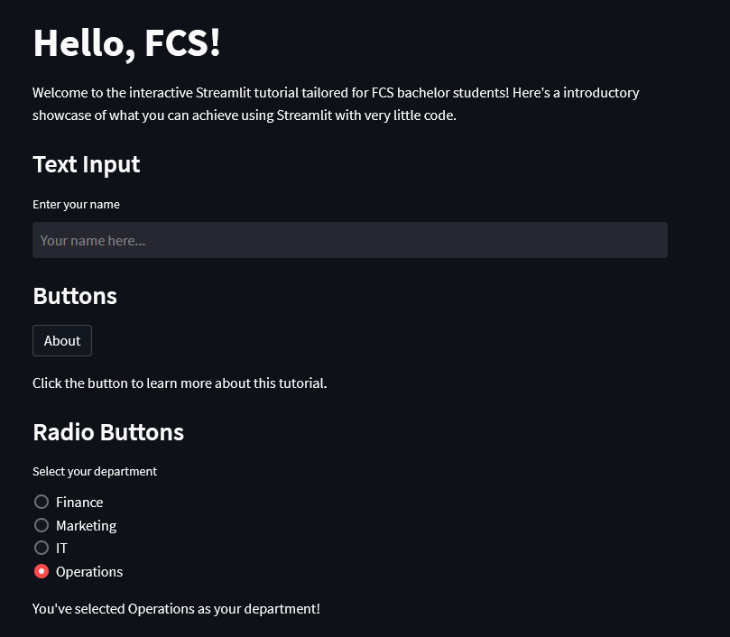

# Streamlit FCS App

Welcome to the Streamlit FCS App! Tailored for the FCS students, this app showcases a range of interactive components to help students understand the power and simplicity of Streamlit.


## Features

- Instructions for creating a Streamlit app from scratch.
- Personalized greetings using name input.
- Interactive department selection.
- GPA slider and visualization.
- Gaussian GPA distribution visualization with dynamic vertical marker.
- Display of a student's GPA percentile within the distribution.
- and more!

## Getting Started

### Demo

A live demo of the app can be found [here](https://fcs-intro.streamlit.app/).

### Prerequisites

- Python 3.8 or newer.
- [Anaconda](https://www.anaconda.com/products/distribution) (recommended for environment management).

### Installation

1. **Clone the repository**:
   ```bash
   git clone https://github.com/hawk-li/streamlit_fcs_app.git
   cd streamlit_fcs_app
    ```

2. **Create & activate a virtual environment**:
    ```bash
    conda create -n streamlit_fcs_app python=3.8
    conda activate streamlit_fcs_app
    ```

3. **Install the required packages**:
    ```bash
    pip install -r requirements.txt
    ```

4. **Run the app**:
    ```bash
    streamlit run app.py
    ```